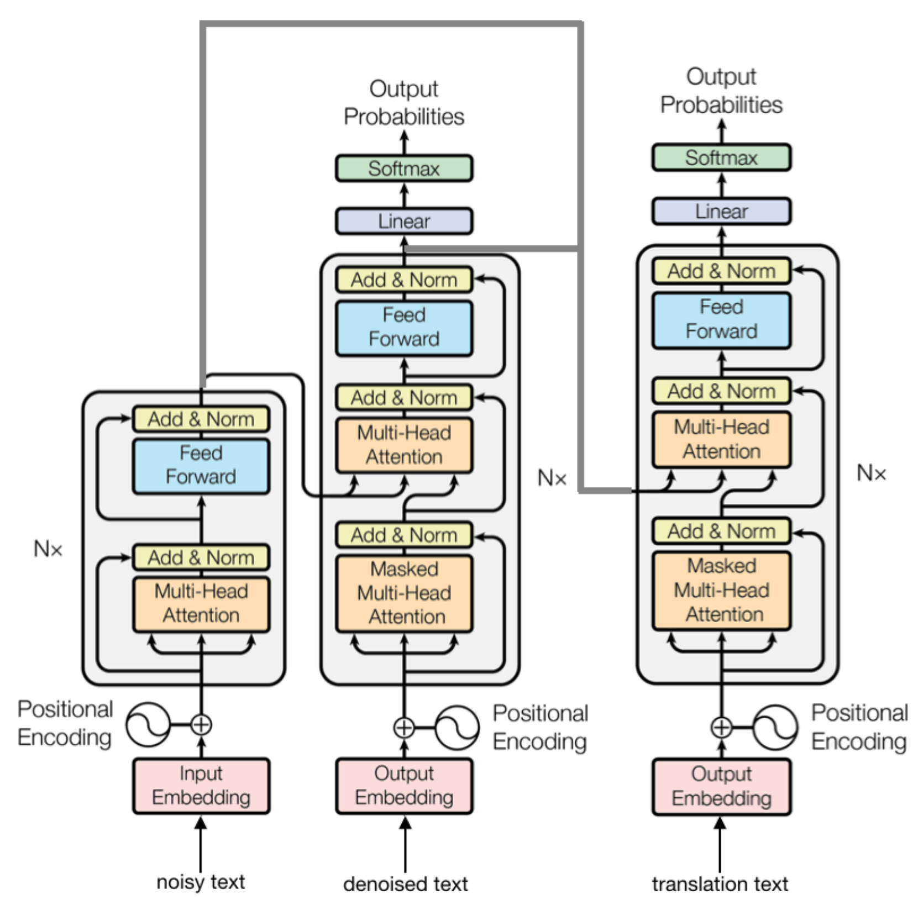

# Multi-task Transformer

This is the source code for [Improving Robustness of Neural Machine Translation with Multi-task Learning](http://www.statmt.org/wmt19/pdf/WMT0068.pdf) for WMT 2019 Robustness shared task. The implementation of the model is completely based on [Fairseq](https://github.com/pytorch/fairseq)

## Overview of the Model


## Core Code
```bash
train.py
multitask_generate.py
fairseq/models/multitask_transformer.py
```
## Sample Usage
### Generate Data
```bash
$RAW_DATA=raw_data_path
$SAVE_DATA=save_path

fairseq-preprocess --source-lang noisy-fr --target-lang fr \
                   # first need files named "*prefix.noisy-fr" and "*prefix.fr", each contains a collection of tokenized sentences, line by line
                   --trainpref $RAW_DATA/train.eur.tok \
                   --validpref $RAW_DATA/val.eur.tok \
                   --testpref $RAW_DATA/test.mtnt.tok \ 
                   --destdir $SAVE_DATA/ # testprefix.fr is a fake file, simply copy noisy-fr
                   --joined-dictionary \ # source language and target language will share dictionary
                   --workers 20
                   
fairseq-preprocess --source-lang fr --target-lang en \
                   # first need files named "*prefix.en" and "*prefix.fr"
                   --trainpref $RAW_DATA/train.eur.tok \
                   --validpref $RAW_DATA/val.eur.tok \
                   --testpref $RAW_DATA/test.mtnt.tok \ 
                   --destdir $SAVE_DATA\
                   --srcdict $SAVE_DATA/dict.fr.txt\ # use the dictionary generate at last step
                   --workers 20
```

### Train
```bash
MODEL_PATH=model_path
python train.py \
                -a multitask_transformer \
                --criterion multitask_label_smoothed_cross_entropy \
                --task multitask_translation \
                --optimizer adam --lr 0.0005 --label-smoothing 0.1 --dropout 0.1 --min-lr '1e-09' \
                --lr-scheduler inverse_sqrt --warmup-updates 4000 --warmup-init-lr '1e-07' \
                --adam-betas '(0.9, 0.98)' \
                --attention-dropout 0.1 -s fr -t en \
                --max-tokens 4000 \
                --no-progress-bar \
                --restore-file MODEL_PATH/checkpoint_best.pt \
                --save-dir MODEL_PATH \
                $SAVE_DATA
```

### Test
```bash
OUTPUT=output_file
python multitask_generate.py \
        --task multitask_translation \
        -s fr -t en \
        --path $MODEL_PATH checkpoint_best.pt \
        $SAVE_DATA \
        --remove-bpe sentencepiece \
        --batch-size 64 \
        --beam 5 \
        --sacrebleu \
        | tee $OUTPUT
```
## Reference
```
@inproceedings{zhou19wmt,
    title = {Improving Robustness of Neural Machine Translation with Multi-task Learning},
    author = {Shuyan Zhou and Xiangkai Zeng and Yingqi Zhou and Antonios Anastasopoulos and Graham Neubig},
    booktitle = {4th Conference on Machine Translation (WMT)},
    address = {Florence, Italy},
    month = {August},
    url = {http://www.statmt.org/wmt19/pdf/WMT0068.pdf},
    year = {2019}
}
```
